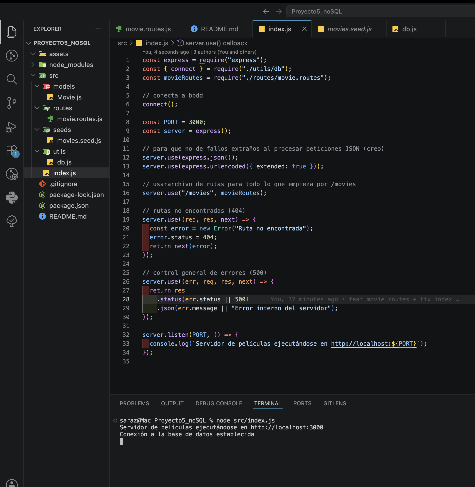
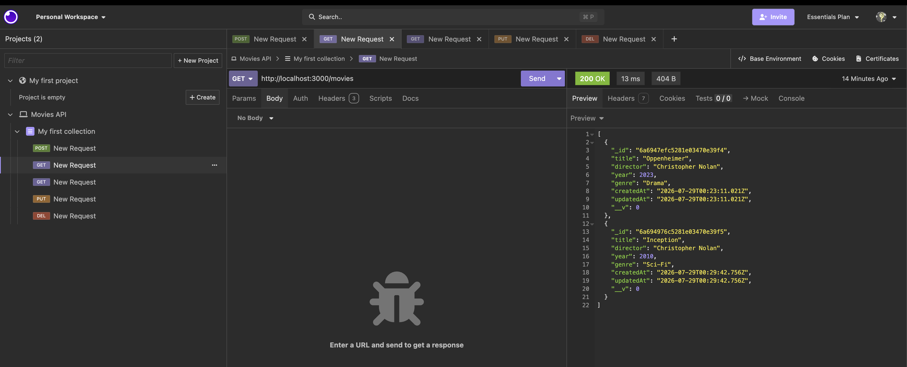
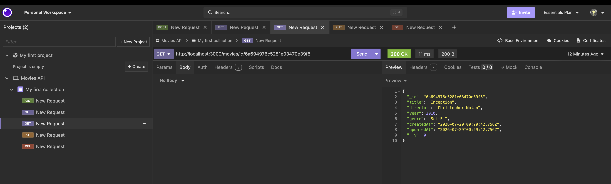
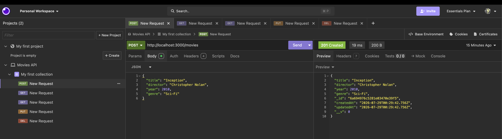
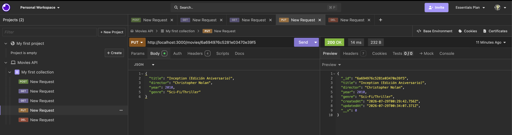
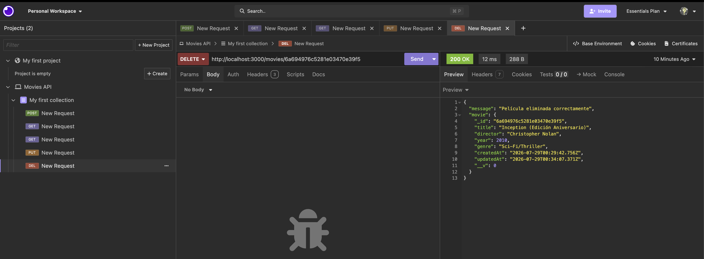

# Proyecto 5 - API REST de Películas (NoSQL + Express)

API RESTful desarrollada con **Node.js**, **Express** y **MongoDB / Mongoose** para la gestión de un catálogo de películas (CRUD).

---

A continuación se muestran las capturas de pantalla con las pruebas ejecutadas en Insomnia y la confirmación de conexión del servidor:

## Arranque del Servidor y Conexión

Confirmación del servidor Express ejecutándose y la base de datos conectada con éxito:

---

## Pruebas de Endpoints en Insomnia

A continuación se muestran las capturas de las peticiones HTTP probadas correctamente:

### 1. `GET` - Obtener todas las películas

### 2. `GET` - Búsqueda por Filtro / ID

### 3. `POST` - Crear película

### 4. `PUT` - Actualizar película

### 5. `DELETE` - Eliminar película

